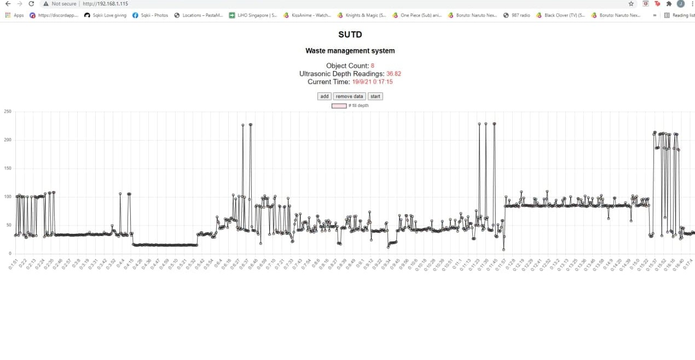
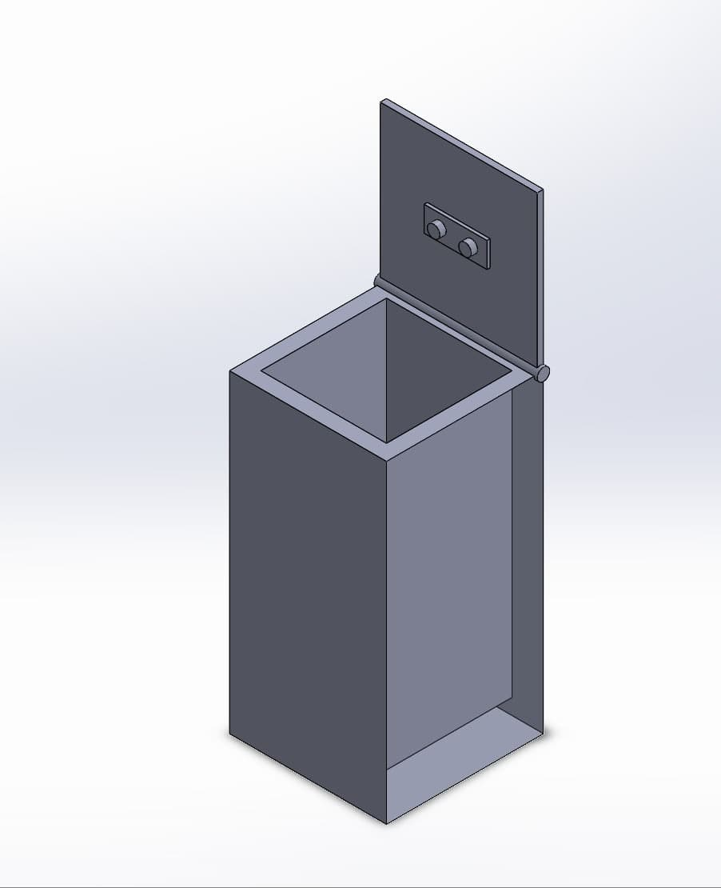

# sutd-wth

Mr. Bin is the first of its kind household waste management system that tracks and categorises household trash to generate useful analytics, with an aim to reduce household waste consumption and increase its recycling rate.

Mr. Bin uses a low cost micro controller to collect and process sensor data using machine learning, artificial intelligence and analytics.

## Webserver

